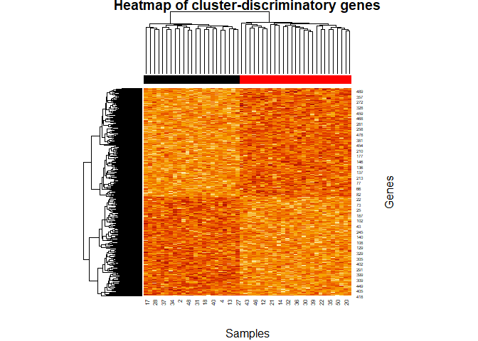

# FSCseq

FSCseq is an R package for simultaneous feature selection and clustering
of RNA-seq gene expression data. It can also correct for differences in
sequencing depth using size factors from `DESeq2` ([Love et
al, 2014](https://doi.org/10.1186/s13059-014-0550-8)), as well as for
covariates such as batch. The main application is in delineating tumor
subtypes, but `FSCseq` can be used for other applications involving
discovery of subpopulations and identification of significant features.
Code to replicate the results from the FSCseq paper is available at
<https://github.com/DavidKLim/FSCseqPaper>.

## Installation

You can install the released version of FSCseq from this repository
with:

``` r
devtools::install_github("DavidKLim/FSCseq")
```

## Example

This example gives a brief overview of how to run `FSCseq` analysis with
simulated data. We show how to use a real RNA-seq read count dataset
instead of simulated data. The extension to a real dataset is
straight-forward

### Step 1: Simulating data

To simulate data, use the `simulateData` function available in `FSCseq`.
Read count expression will be simulated from a finite mixture of
negative binomials. For ease of use, simulated data will be saved
automatically in the `save_dir` directory, and will be saved in object
`sim.dat`. In this example, one dataset is simulated (`nsims`) with
10000 genes (`G`) and 50 samples (`n`) from 1 batch (`B`) with 2
underlying clusters (`K`), baseline \_2 mean of 12 (`beta0`), and
overdispersion of 0.35 (`phi`).

``` r
B=1; g=10000; K=2; n=50; LFCg=1; pDEg=0.05; beta0=12; phi0=0.35; nsims=1
set.seed(999)
FSCseq::simulateData(B=B, g=g, K=K, n=n, LFCg=LFCg, pDEg=pDEg,
             beta0=beta0, phi0=phi0, nsims=nsims, save_dir="~/test")
#> [1] "~/test/2_50_1.000000_0.050000_12.000000_0.350000_sim1_data.RData"
```

The simulated count matrix `cts` can then be accessed as
follows:

``` r
load(sprintf("~/test/%d_%d_%f_%f_%f_%f_sim1_data.RData",K,n,LFCg,pDEg,beta0,phi0))
cts = sim.dat$cts
```

To perform analysis on your own data, download the read counts and load
it. This example shows how to acquire the TCGA Breast Cancer Dataset
available on the NCI [GDCPortal](https://portal.gdc.cancer.gov/), using
the `TCGAbiolinks` package. Warning: this query contains 1215 files with
a total of about 1.84 GB, and will take a long time to download:

``` r
# library(devtools)
# devtools::install_github("BioinformaticsFMRP/TCGAbiolinks")
library(TCGAbiolinks)
query1 = GDCquery(project="TCGA-BRCA",
                data.category = "Gene expression",
                data.type = "Gene expression quantification",
                platform = "Illumina HiSeq",
                file.type  = "results",
                experimental.strategy = "RNA-Seq",
                legacy = TRUE)
GDCdownload(query1)
GDCprepare(query = query1, save = TRUE, save.filename = "TCGA_BRCA_exp.rda")
```

Then, read the saved data into the R environment

``` r
load(file="TCGA_BRCA_exp.rda")
library(SummarizedExperiment)
cts <- round(assay(data),0)
cts <- cts[!duplicated(cts[,1:ncol(cts)]),]
anno <- colData(data)@listData
```

Optionally, you may want to pre-filter out genes with low FPKM values.
Then, you can proceed with the subsequent steps with the `cts`, matrix
as in the simulated data. Details of the processing steps and analyses
on the TCGA BRCA dataset can be found
[here](https://github.com/DavidKLim/FSCseqPaper). In the subsequent
steps, we walk through just the simulated data.

### Step 2: Performing clustering and feature selection

Input the simulated `cts` matrix into `FSCseq_workflow`. Default search
grids for tuning parameters are preset. For brevity of illustration, we
go through FSCseq analysis with a much smaller grid of values of tuning
parameters (takes about 5-6
minutes):

``` r
load(sprintf("~/test/%d_%d_%f_%f_%f_%f_sim1_data.RData",K,n,LFCg,pDEg,beta0,phi0))
cts = sim.dat$cts; true_cls=sim.dat$cls

t0 = as.numeric(Sys.time())
FSCseq_results = FSCseq::FSCseq_workflow(cts=cts,K_search=c(2:3),lambda_search=c(0.25,0.50),alpha_search=c(0.3,0.4),dir_name="~/test/Saved_Results")
#> Warning in FSCseq::FSCseq_workflow(cts = cts, K_search = c(2:3),
#> lambda_search = c(0.25, : No input batch. Assuming all samples from same
#> batch
#> converting counts to integer mode
t1 = as.numeric(Sys.time())
print(paste("time elapsed:",t1-t0))
#> [1] "time elapsed: 321.833613157272"
```

### Step 3: Summarizing and visualizing results

We can now summarize our clustering results. `FSCseq_workflow` outputs
the processed data after pre-filtering and normalizing for differences
in sequencing depth, as well as the results from FSCseq analysis. Store
included genes in `idx` to compare FSCseq results `res` with simulated
data:

``` r
res = FSCseq_results$results
processed.dat = FSCseq_results$processed.dat
idx = processed.dat$idx
library(mclust)
#> Package 'mclust' version 5.4.5
#> Type 'citation("mclust")' for citing this R package in publications.
print(paste("True K:",K,"Optimal K:",length(unique(res$cls))))
#> [1] "True K: 2 Optimal K: 2"
print(paste("ARI:",adjustedRandIndex(true_cls,res$cls)))
#> [1] "ARI: 1"
table(true_cls,res$cls)
#>         
#> true_cls  1  2
#>        1 23  0
#>        2  0 27
```

We can also show the true positive rate (TPR) and false positive rate
(FPR) of feature selection in discovering cluster-discriminatory genes:

``` r
true_disc = sim.dat$DEg_ID[idx];
FSC_disc = res$discriminatory

print(paste("TPR: ",sum(true_disc & FSC_disc)/sum(true_disc)))
#> [1] "TPR:  0.64070351758794"
print(paste("FPR: ",sum(!true_disc & FSC_disc)/sum(!true_disc)))
#> [1] "FPR:  0.000869187309865276"
```

We can visualize the expression patterns by plotting a heatmap, with
column annotations denoting cluster membership (red/black)

``` r
processed.dat = FSCseq_results$processed.dat
norm_y = processed.dat$norm_y
heatmap(log(norm_y[sim.dat$DEg_ID,]+0.1),scale="row",ColSideColors = as.character(res$cls),xlab="Samples",ylab="Genes",main="Heatmap of cluster-discriminatory genes")
```



### Step 4 (optional): Predicting on new data

`simulateData` additionally simulates a test set with the same simulated
parameters, in order to perform prediction after fitting the FSCseq
model on the training set. Input the FSCseq fitted object `res$fit` into
`FSCseq_predict_workflow`, along with the count matrix of the test set.
The count matrix of the training set is also required to use as a
pseudo-reference for the calculation of size factors in the test set.
Input `idx` to narrow down list of genes to those included in FSCseq
analyses.

``` r
cts_pred = sim.dat$cts_pred
true_cls_pred = sim.dat$cls_pred
fit_pred = FSCseq::FSCseq_predict_workflow(fit=res$fit,cts=cts,cts_pred=cts_pred,idx=idx)
#> converting counts to integer mode
```

``` r
res_pred = fit_pred$results
print(paste("pARI: ",adjustedRandIndex(true_cls_pred,res_pred$clusters)))
#> [1] "pARI:  1"
```

This anaysis can be easily generalized to real data by replacing
`cts_pred` with a separate test dataset, after fitting the FSCseq model
on the training dataset.
