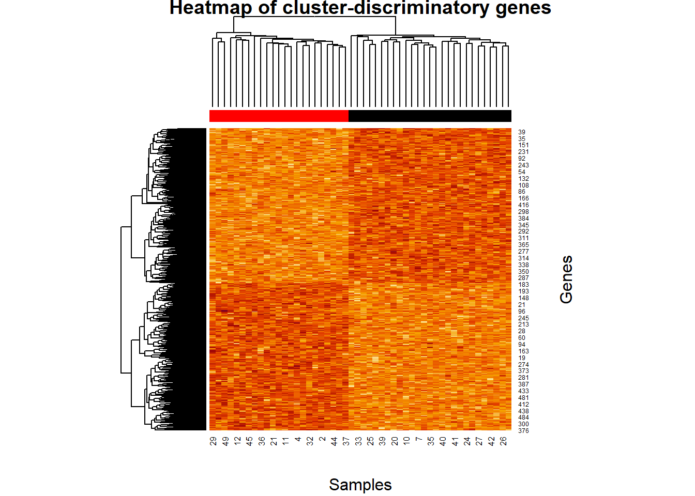

# FSCseq

FSCseq is an R package for simultaneous feature selection and clustering
of RNA-seq gene expression data. It can also correct for differences in
sequencing depth using size factors from `DESeq2` ([Love et
al, 2014](https://doi.org/10.1186/s13059-014-0550-8)), as well as for
covariates such as batch. The main application is in delineating tumor
subtypes, but `FSCseq` can be used for other applications involving
discovery of subpopulations and identification of significant features.
Code to replicate the results from the FSCseq paper is available at
<https://github.com/DavidKLim/FSCseqPaper>.

## Installation

You can install the released version of FSCseq from this repository
with:

``` r
devtools::install_github("DavidKLim/FSCseq")
```

## Example

This example gives a brief overview of how to run `FSCseq` analysis with
simulated data. We show how to use a real RNA-seq read count dataset
instead of simulated data. The extension to a real dataset is
straight-forward

### Step 1a: Simulating data

To simulate data, use the `simulateData` function available in `FSCseq`.
Read count expression will be simulated from a finite mixture of
negative binomials. For ease of use, simulated data will be saved
automatically in the `save_dir` directory, and will be saved in object
`sim.dat`. In this example, one dataset is simulated (`nsims`) with
10000 genes (`G`, default) and 50 samples (`n`) from 1 batch (`B`,
default) with 2 underlying clusters (`K`), baseline

mean of 12 (`beta0`), and overdispersion of 0.35 (`phi`).

``` r
B=1; g=10000; K=2; n=50; LFCg=1; pDEg=0.05; beta0=12; phi0=0.35
set.seed(9)
sim.dat = FSCseq::simulateData(B=B, g=g, K=K, n=n, LFCg=LFCg, pDEg=pDEg,
             beta0=beta0, phi0=phi0, nsims=1, save_file=FALSE)
# for save_file=TRUE, can input custom save_dir and save_prefix for parallelization of downstream analyses
```

The `simulateData` function outputs a list of length `nsims` with a
`sim.dat` list object for each simulation. The contents of `sim.dat` can
be examined as follows, where each element of the list corresponds to a
distinct simulated dataset:

``` r
str(sim.dat)
#> List of 1
#>  $ :List of 9
#>   ..$ cts       : num [1:10000, 1:50] 1145 1203 2810 7645 1867 ...
#>   ..$ cts_pred  : num [1:10000, 1:25] 4217 5317 3312 7618 4077 ...
#>   ..$ cls       : int [1:50] 2 1 1 1 1 1 2 2 2 2 ...
#>   ..$ cls_pred  : int [1:25] 2 2 1 2 2 1 2 2 2 1 ...
#>   ..$ batch     : num [1:50] 0 0 0 0 0 0 0 0 0 0 ...
#>   ..$ SF        : num [1:50] 0.808 0.796 0.965 0.931 1.109 ...
#>   ..$ SF_pred   : num [1:25] 1.438 0.863 0.785 1.012 0.95 ...
#>   ..$ DEg_ID    : logi [1:10000] TRUE TRUE TRUE TRUE TRUE TRUE ...
#>   ..$ sim_params:List of 18
#>   .. ..$ K       : num 2
#>   .. ..$ B       : num 1
#>   .. ..$ g       : num 10000
#>   .. ..$ n       : num 50
#>   .. ..$ n_pred  : num 25
#>   .. ..$ pK      : num [1:2] 0.5 0.5
#>   .. ..$ pB      : num 1
#>   .. ..$ LFCg    : num 1
#>   .. ..$ pDEg    : num 0.05
#>   .. ..$ sigma_g : num 0.1
#>   .. ..$ LFCb    : num 0
#>   .. ..$ pDEb    : num 0.5
#>   .. ..$ sigma_b : num 0
#>   .. ..$ beta    : num [1:10000, 1:2] 12 12 12 12 12 12 12 12 12 12 ...
#>   .. ..$ phi     : num [1:10000] 0.35 0.35 0.35 0.35 0.35 0.35 0.35 0.35 0.35 0.35 ...
#>   .. ..$ disp    : chr "gene"
#>   .. ..$ LFCg_mat: num [1:10000, 1:2] 1 1 1 0 1 1 1 1 1 0 ...
#>   .. ..$ DEb_ID  : logi [1:10000] TRUE TRUE TRUE FALSE TRUE FALSE ...
```

### Step 1b: Analyzing custom data

To perform analysis on your own data, download the read counts and load
it. This example shows how to acquire the TCGA Breast Cancer Dataset
available on the NCI [GDCPortal](https://portal.gdc.cancer.gov/), using
the `TCGAbiolinks` package. Warning: this query contains 1215 files with
a total of about 1.84 GB, and will take a long time to download:

``` r
# library(devtools)
# devtools::install_github("BioinformaticsFMRP/TCGAbiolinks")
library(TCGAbiolinks)
query1 = GDCquery(project="TCGA-BRCA",
                data.category = "Gene expression",
                data.type = "Gene expression quantification",
                platform = "Illumina HiSeq",
                file.type  = "results",
                experimental.strategy = "RNA-Seq",
                legacy = TRUE)
GDCdownload(query1)
GDCprepare(query = query1, save = TRUE, save.filename = "TCGA_BRCA_exp.rda")
```

Then, read the saved data into the R environment

``` r
load(file="TCGA_BRCA_exp.rda")
library(SummarizedExperiment)
cts <- round(assay(data),0)
cts <- cts[!duplicated(cts[,1:ncol(cts)]),]
anno <- colData(data)@listData
```

Optionally, you may want to pre-filter out genes with low FPKM values.
Subtype information for the TCGA BRCA dataset used in our paper can be
obtained using the `TCGAquery_subtype()` function, and used as the true
cluster labels. These true cluster labels are optional, but useful to
track diagnostics in FSCseq:

``` r
BRCA_tab = TCGAquery_subtype("BRCA")
match_ids = match(anno$patient, BRCA_tab$patient) # match patients
anno$subtypes = BRCA_tab$BRCA_Subtype_PAM50[match_ids]

true_cls = as.numeric(as.factor(anno$subtypes))
```

Then, you can proceed with the subsequent steps with the `cts` matrix
and true cluster labels `true_cls`, as in the simulated data. Details of
the processing steps and analyses on the TCGA BRCA dataset performed in
our paper can be found [here](https://github.com/DavidKLim/FSCseqPaper).
In the subsequent steps, we walk through just the simulated dataset, but
analysis can be done on your own data using the same steps.

### Step 2: Performing clustering and feature selection

For brevity of illustration, we go through FSCseq analysis on the
previously simulated dataset with a much smaller grid of values of
tuning parameters. First, we subset the simulated dataset. In this
example, we subset to just the 1st element of `sim.dat` since `nsims=1`,
but for `nsims>1`, other simulated datasets can be accessed by changing
the index value. The contents of each `sim.dat` object can be accessed,
and counts and true cluster labels can be extracted as follows:

``` r
simdat = sim.dat[[1]]
cts=simdat$cts; true_cls=simdat$cls
```

Then, we run the FSCseq workflow. To do this, we input the simulated (or
custom) `cts` matrix into `FSCseq_workflow`. Default search grids for
tuning parameters are preset. Note that `dir_name` should be unique, in
order to avoid utilizing saved results from a previously analyzed
dataset. The workflow on this example dataset took about 5 minutes to
complete:

``` r
t0 = as.numeric(Sys.time())
FSCseq_results = FSCseq::FSCseq_workflow(cts=cts,
                                         K_search=c(2:3),
                                         lambda_search=c(1.0, 1.5),
                                         alpha_search=c(0.1, 0.2), dir_name="~/test/Saved_Results")
#> No input batch. All samples from the same batch
#> Computing size factors...
#> converting counts to integer mode
#> Initializing warm starts...
#> K = 2 ... done.
#> K = 3 ... done.
#> Tuning parameters...
#> K = 2 ... done.
#> K = 3 ... done.
t1 = as.numeric(Sys.time())
print(paste("time elapsed:",t1-t0))
#> [1] "time elapsed: 279.909837961197"
res = FSCseq_results$results
```

Note that we did not simulate batch in this case. If batch was
simulated, an additional argument `batch = ...` can be input to adjust
for these batch effects. Additionally, a custom design matrix `X = ...`
can also be specified. By default, `batch` is assumed to not be included
in the `X` design matrix. If both `batch` and `X` are specified, then
the design matrix will be augmented with batch as an additional
covariate.

### Step 3: Summarizing and visualizing results

We can now summarize our clustering results. `FSCseq_workflow` outputs
the processed data after pre-filtering and normalizing for differences
in sequencing depth, as well as the results from FSCseq analysis. Subset
true cluster-discriminatory genes (as simulated) to those genes in
`idx`, which were included in analysis after pre-filtering. This allows
for comparison between true and derived cluster-discriminatory genes.

``` r
processed.dat = FSCseq_results$processed.dat
idx = processed.dat$idx  # IDs of genes that were included in clustering analysis after pre-filtering
true_disc = simdat$DEg_ID[idx]

summ = summary(res, true_cls, true_disc)  # true_cls and true_disc optional
#> K: 2 
#> True K: 2 
#> ARI: 1 
#>         cls
#> true_cls  1  2
#>        1  0 23
#>        2 27  0
#> -----------------
#> TPR: 0.934383202099738 
#> FPR: 0.0138558129465252 
#> -----------------
#> cls (first 5 samples):
#> [1] 1 2 2 2 2
#> disc (first 5 genes):
#> [1] TRUE TRUE TRUE TRUE TRUE
```

The `true_cls` and `true_disc` arguments are optional for the
`summary()` function. Inputting `true_cls` additionally outputs the ARI
and a two-way table comparing the true and derived cluster labels.
Inputting `true_disc` additionally outputs the true positive rate (TPR)
and false positive rate (FPR) of discovering true cluster-discriminatory
genes.

We can additionally visualize the expression patterns by plotting a
heatmap, with column annotations denoting cluster membership (red/black)

``` r
norm_y = processed.dat$norm_y
heatmap(log(norm_y[simdat$DEg_ID,]+0.1),
        scale="row",ColSideColors = as.character(res$cls),
        xlab="Samples",ylab="Genes",main="Heatmap of cluster-discriminatory genes")
```



### Step 4 (optional): Predicting on new data

`simulateData` additionally simulates a test set with the same simulated
parameters, in order to perform prediction after fitting the FSCseq
model on the training set. Input the FSCseq fitted object `res$fit` into
`FSCseq_predict_workflow`, along with the count matrix of the test set.
The count matrix of the training set is also required to use as a
pseudo-reference for the calculation of size factors in the test set.
Input `idx` to narrow down list of genes to those included in FSCseq
analyses.

``` r
cts_pred = simdat$cts_pred
true_cls_pred = simdat$cls_pred
fit_pred = FSCseq::FSCseq_predict_workflow(fit = res$fit,
                                           cts = cts,
                                           cts_pred = cts_pred,
                                           idx = idx)
#> Computing size factors...
#> converting counts to integer mode
#> Computing predictive posterior probabilities...
#> No covariates specified. Predicting on cluster-specific intercept-only model.
res_pred = fit_pred$results
library(mclust)
#> Package 'mclust' version 5.4.5
#> Type 'citation("mclust")' for citing this R package in publications.
print(paste( "pARI: ", adjustedRandIndex(true_cls_pred, res_pred$clusters) ))
#> [1] "pARI:  1"
```

This analysis can be generalized to real data by replacing `cts_pred`
with a separate test dataset, after fitting the FSCseq model on the
training dataset.
